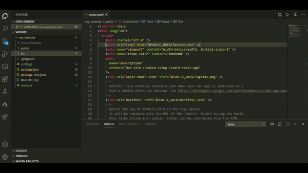

# What Is (VS Code Extension)

At a VS Code Hackathon, I created an extension called __What Is__ that helps beginner programmers become familiar with certain project files that may seem confusing and daunting at first. As a programmer, I always like to understand how everything works and what everything means. That's why I found it hard to jump right in to a project when there was so much starter code and so many auto-generated files that I didn't understand. This extension was created so that others can learn briefly about these files and feel more comfortable starting a new project.

## How it Works

The file options currently supported are the following:
* __package.json__
* __package-lock.json__
* __README.md__
* __.gitignore__
* __robots.txt__

When one of these files appears in your project, you will have the option to learn more about the file by right-clicking on it and selecting the feature __What Is__. A brief description of the file will then be shown in a message.

 

## Release Notes

### 1.0.0 
_6/28/20_: Initial release of __What Is__ VS Code Extension, supported file options include package.json, package-lock.json, README.md, .gitignore, and robots.txt.

